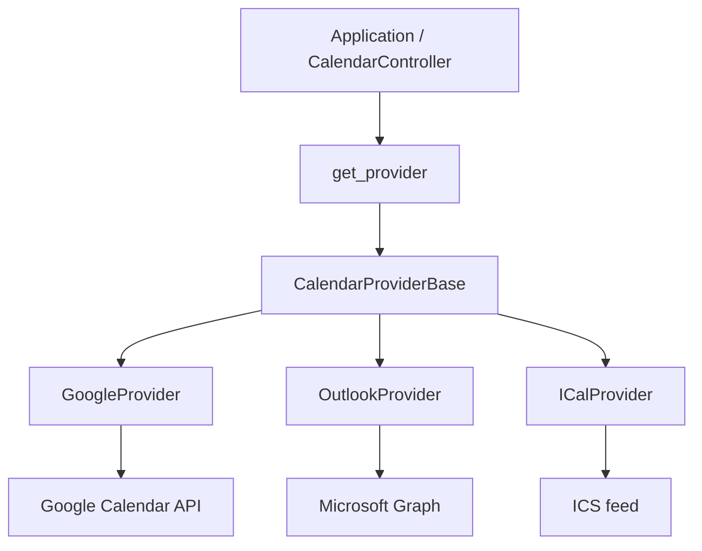

# Calendar Provider Reference

A sanitized reference implementation of the multi-provider calendar integration used in a larger backend (`backend-studios`).

The folder layout, class names, factory, and provider method signatures match that codebase so you can read this repo and the production helpers side by side.

This is **not** a dump of the production application. Flask, SQL, queues, and real credentials are replaced with stand-ins. There are **no production secrets**.

## Problem

Google Calendar, Microsoft Outlook, and iCal / Apple Calendar do not share one API. Without a provider layer, every feature grows `if provider == "google"` branches.

## Why one abstraction

The caller (in production: `CalendarController`) does:

```python
from app.helpers.calendar.factory import get_provider

prov = get_provider(provider, user_id)
intent, url, role, organizer_id, state = prov.start_connect(...)
```

It does not import Google or Microsoft clients.

## Architecture

This repo uses the same paths as `backend-studios`:

```text
app/helpers/calendar/     # providers
app/models/Calendar.py    # persistence (in-memory here, SQL in production)
app/helpers/Util.py
app/config.py             # stand-in for Flask current_app.config
```



```text
CalendarProviderBase
    start_connect()
    build_auth_url()    # OAuth providers
    exchange_code()     # OAuth providers
    revoke()
    create_event()      # Google / Outlook
    update_event()
    delete_event()
       │
       ├── GoogleProvider
       ├── OutlookProvider
       └── ICalProvider     # feed URL only; no OAuth / no push events
```

iCal is not forced to implement `exchange_code`. Those methods stay `NotImplementedError` on the base class, same as production.

`Calendar.py` here keeps the **same method names** as production (`upsert_connection`, `ics_get_or_create_token`, …) but stores data in memory instead of MySQL.

`current_app` is a small stand-in. Production uses Flask:

```python
from flask import current_app as app
```

This repo:

```python
from app.config import current_app as app
```

Config **keys** are the same (`GOOGLE_CLIENT_ID`, `MS_CLIENT_ID`, `CLASSFIT_URL`, …). Values come from `.env`.

## Factory

```python
mapping = {
    "google":  GoogleProvider,
    "apple":   ICalProvider,
    "ical":    ICalProvider,
    "outlook": OutlookProvider,
}
```

`get_provider("yahoo", user_id)` returns `None`, same as production.

## Polymorphism / strategy

`GoogleProvider` and `OutlookProvider` both implement `create_event(**payload)`. The controller does not care which class it received.

iCal's `start_connect` returns `("feed_url", url, ...)`. Google/Outlook return `("oauth_redirect", url, ...)`.

## Adapter

- **GoogleProvider** wraps Google OAuth (`Flow`, `Credentials`) and Calendar API v3 (`events().insert/patch/delete`).
- **OutlookProvider** wraps Microsoft identity and Graph (`/me/events`).

A shared payload (`title`, `start`, `end`, `timezone`, `class_id`, …) is mapped to each vendor's JSON inside the provider.

## How to add another provider

1. Add `app/helpers/calendar/new_provider.py` subclassing `CalendarProviderBase`.
2. Register it in `factory.py`.
3. Keep vendor API details inside that file.

## Environment setup

```bash
python3 -m venv .venv
source .venv/bin/activate
pip install -r requirements.txt
cp .env.example .env
```

`.env.example` has placeholders only. Never commit real OAuth client secrets.

## Example usage

```bash
python examples/basic_usage.py
```

```python
from app.helpers.calendar.factory import get_provider

prov = get_provider(provider, user_id)
if not prov:
    raise ValueError(f"Unsupported provider: {provider}")

intent_type, url, role, organizer_id, state = prov.start_connect(
    role=role, organizer_id=organizer_id, user_id=user_id
)
```

`provider` is only a string (`"google"` / `"outlook"` / `"ical"`). After `get_provider`, the caller never branches on that name.

## Tests

```bash
pytest
```

External Google / Microsoft HTTP calls are mocked.

## What differs from production (~10%)

- `Calendar` is in-memory, not SQL.
- Flask is replaced by `app.config.current_app`.
- No controller, queues, or widget HTML.
- Config values are env placeholders, not production credentials.

## License

MIT. See [LICENSE](LICENSE).
